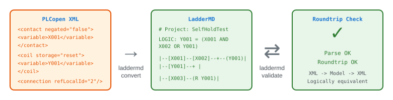
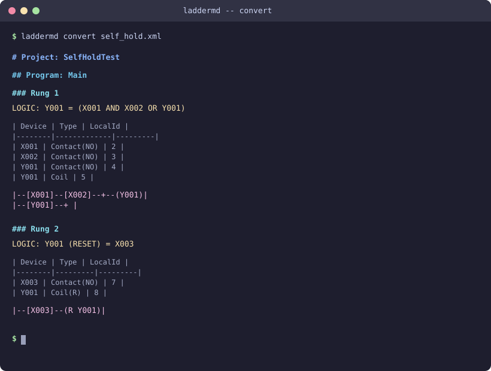

# LadderMD

**PLCopen XML をMarkdown/DSLに変換するラダー図コンバーター**

[English](README.md)

<p align="center">
  
</p>

## なぜ LadderMD を作ったのか

### PLCラダー図は「電気屋の世界」に閉じている

PLCラダー図は工場の自動化を支える基盤技術だが、三菱GX Works、オムロンSysmac、シーメンスTIA Portalなど、各メーカー独自のバイナリ形式で保存されている。`git diff` で差分を見ることも、`grep` で変数名を検索することも、プルリクエストで制御ロジックの変更をレビューすることもできない。

この背景には文化的な断絶がある。ラダー図を書くのは制御エンジニア（いわゆる「電気屋」）であり、ソフトウェアエンジニアではない。Yahoo!知恵袋の[あるベストアンサー](https://detail.chiebukuro.yahoo.co.jp/qa/question_detail/q13247817043)がこの構造を端的に表している:

> ラダーを使っている人たちは電気屋であって、コンピュータ屋ではありません。

使われているツールもそれを反映している。グラフィカルで、プロプライエタリで、現代の開発ワークフローから切り離されている。

### LLM/AIエージェントが制御ロジックを読めない

現代のAIエージェントはテキストを処理する -- Markdown、コード、構造化データ。Cloudflareの「[Markdown for Agents](https://blog.cloudflare.com/markdown-for-agents/)」がHTMLのMarkdown変換を推進しているように、すべてのコンテンツはテキストとして機械が消費できるべきだ。

PLCラダー図にはそのようなテキスト表現が存在しない。PLCopen XML（IEC 61131-10）という国際標準の交換フォーマットはあるが、生のXMLは冗長で、山括弧やネームスペース宣言にトークンを浪費し、ロジックの伝達効率が悪い。ラダー回路が何をしているのかをLLMが理解できる、コンパクトで読みやすいテキスト形式は現時点で存在しない。

### 技術継承の危機

製造業の現場では、20〜30年前に書かれたラダープログラムが今も本番稼働しているケースが珍しくない。しかし、元の設計者はとうに退職している。プログラムの修正が必要になったとき、「なぜこの回路がこう設計されたのか」という知識は多くの場合、失われている。

ラダー図がテキストとして存在していれば、LLMが説明できる。「これは非常停止インターロック付きの自己保持回路です。X010のb接点はフェイルセーフを保証しています。」しかし現状、これらの図面は各メーカーの専用ソフトでしか閲覧できず、自動的な解析は不可能だ。

## LadderMDが解決すること

LadderMDはPLCラダー図をPLCopen XML（国際標準の交換フォーマット）からパースし、人間とAIが読めるMarkdownに変換する。往復変換（XML -> モデル -> XML）で論理的等価性を検証できる。コアライブラリはCLI非依存で、Web API・デスクトップアプリ・言語バインディングへの拡張を前提に設計されている。Rustで実装されており、基本回路のパースは約20マイクロ秒で完了する。

## 特徴

- **パース** -- PLCopen XML（TC6 v2.01）のラダー図を型安全な内部モデルにデシリアライズ
- **レンダリング** -- 論理式・デバイステーブル・ASCIIアート図をMarkdownで出力
- **XML書き出し** -- 内部モデルからPLCopen XMLを再生成
- **往復変換検証** -- XML -> モデル -> XML -> モデルの論理的等価性を自動検証
- **高速** -- 基本回路を約20マイクロ秒でパース（`quick-xml`のゼロコピーパーサー）
- **ライブラリファースト** -- コアロジックはCLI非依存のcrateとして分離。Web API / デスクトップ / バインディングに対応可能

## デモ

### `laddermd convert` -- XMLからMarkdownに変換

<p align="center">
  
</p>

### `laddermd validate` -- 往復変換の検証

<p align="center">
  
</p>

## インストール

```bash
# クローンしてビルド
git clone https://github.com/PeterTakahashi/LadderMD.git
cd laddermd
cargo build --release

# バイナリは target/release/laddermd-cli に生成されます
```

Rust 1.75以上（stable）が必要です。

## 使い方

### PLCopen XMLをMarkdownに変換

```bash
# 標準出力に出力
laddermd convert input.xml

# ファイルに出力
laddermd convert input.xml -o output.md

# 出力セクションを個別に無効化
laddermd convert input.xml --no-diagram   # アスキーアート図を非表示
laddermd convert input.xml --no-table     # デバイステーブルを非表示
laddermd convert input.xml --no-logic     # 論理式を非表示
```

### プロジェクト情報の表示

```bash
$ laddermd info input.xml
Project: SelfHoldTest
  Program: Main
    Rungs: 2
    Contacts: 4, Coils: 2, Blocks: 0
```

### 往復変換テスト

```bash
$ laddermd validate input.xml
Parse OK: 2 rungs found
Devices: 4 contacts, 2 coils, 0 blocks
Roundtrip OK: all rungs logically equivalent
```

## 出力フォーマット（LadderMD）

各ラング（横棒1段）は3つのセクションで構成されます:

**1. 論理式** -- ラングのブール式

```
LOGIC: Y001 = (X001 AND X002 OR Y001)
```

**2. デバイステーブル** -- ラング内の全接点・コイル・ブロック

```
| Device | Type        | LocalId |
|--------|-------------|---------|
| X001   | Contact(NO) | 2       |
| X002   | Contact(NO) | 3       |
| Y001   | Coil        | 5       |
```

**3. ASCIIラダー図** -- ビジュアル表現

```
|--[X001]--[X002]--+--(Y001)|
|--[Y001]--+        |
```

### シンボル一覧

| シンボル | 意味 |
|----------|------|
| `[X001]` | a接点（常開接点 / Normally Open） |
| `[/X001]` | b接点（常閉接点 / Normally Closed） |
| `(Y001)` | 出力コイル |
| `(S Y001)` | セット（ラッチ）コイル |
| `(R Y001)` | リセット（アンラッチ）コイル |
| `[TON T1]` | ファンクションブロック（タイマー等） |
| `--+--` | 並列分岐の合流点（OR） |

## 対応回路

| 回路 | 説明 | テストファイル |
|------|------|----------------|
| 自己保持回路 | シールイン接点 + リセット | `self_hold.xml` |
| インターロック回路 | b接点による相互排他 | `interlock.xml` |
| タイマー回路 | TONオンディレイタイマー | `timer.xml` |
| 非常停止回路 | b接点の非常停止 + 自己保持 | `emergency_stop.xml` |
| カウンター回路 | CTU（カウントアップ）・CTD（カウントダウン） | `counter.xml` |
| 比較・演算回路 | GT, EQ, ADDなどのファンクションブロック | `comparison.xml` |

## アーキテクチャ

```
laddermd/
├── crates/
│   ├── laddermd-core/       # ライブラリcrate（CLI非依存）
│   │   └── src/
│   │       ├── model.rs     # 内部データモデル
│   │       ├── parser/      # PLCopen XML -> モデル
│   │       ├── renderer/    # モデル -> Markdown
│   │       ├── writer/      # モデル -> PLCopen XML
│   │       └── validator/   # 往復変換の等価性検証
│   └── laddermd-cli/        # CLIバイナリ
└── tests/fixtures/          # テスト用PLCopen XMLファイル
```

コアライブラリ（`laddermd-core`）はCLIに一切依存せず、以下のパブリックAPIを提供します:

```rust
use laddermd_core::{parser, renderer::MarkdownRenderer, writer, validator};

// パース
let project = parser::parse(&xml_string)?;

// Markdownにレンダリング
let renderer = MarkdownRenderer::default();
let markdown = renderer.render(&project);

// XMLに書き出し
let xml_output = writer::write(&project)?;

// 往復変換を検証
let result = validator::validate(&xml_string)?;
assert!(result.roundtrip_ok);
```

## ベンチマーク

`cargo bench` で実行:

| テストファイル | パース時間 |
|----------------|-----------|
| self_hold.xml | 約24 us |
| interlock.xml | 約22 us |
| timer.xml | 約21 us |
| emergency_stop.xml | 約16 us |

## 開発

```bash
# テスト実行
cargo test

# Lintチェック
cargo clippy

# ベンチマーク
cargo bench
```

## ビジョン / ロードマップ

### 短期（v0.x）

- [x] 基本回路: 自己保持、インターロック、タイマー、非常停止
- [x] カウンターブロック（CTU, CTD）
- [x] 比較・演算ブロック（GT, GE, EQ, LE, LT, NE, ADD, SUB, MUL, DIV, MOD）

### 中期（v1.x）

- [x] 三菱GX Worksニモニック形式の入力対応 -- 日本の製造現場で支配的なPLCプラットフォームをカバー
- [x] MCP（Model Context Protocol）サーバー化 -- AIエージェントがラダー図を直接読み書き可能に
- [x] Web API（axum）-- 変換サービスとして提供
- [x] デスクトップビューア（Tauri）
- [x] Pythonバインディング（PyO3）/ Node.jsバインディング（napi-rs）

### 長期

- [ ] LLMによる回路解析・安全性検証の基盤となることを目指す
  - 例:「この非常停止回路に抜けはないか？」「このインターロックは正しく動作するか？」

## ライセンス

MIT
